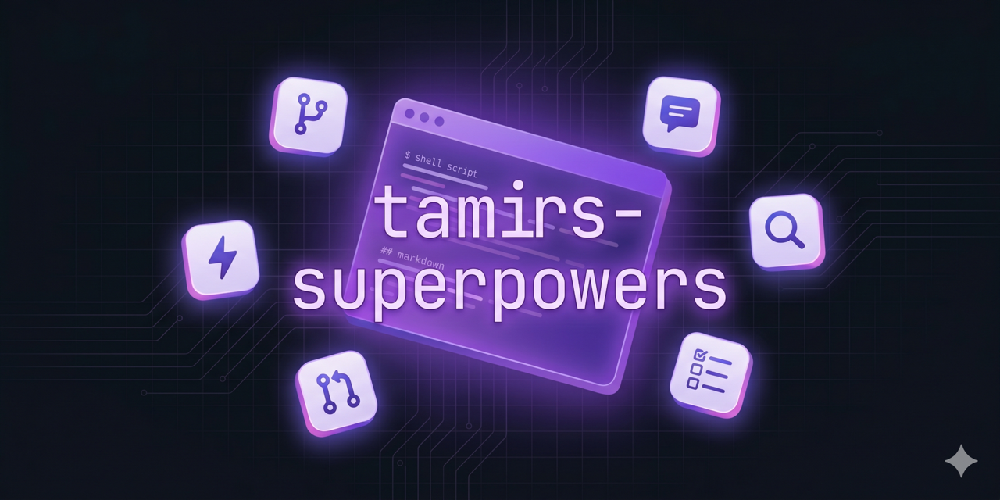

<p align="center">
  
</p>

<p align="center">
  <a href="https://github.com/Tamircohen28/tamirs-superpowers/actions/workflows/ci.yml">
    
  </a>
  <a href="LICENSE">
    
  </a>
  <a href=".claude-plugin/plugin.json">
    
  </a>
</p>

# tamirs-superpowers

A personal Claude Code plugin that bundles 17 skills, smart worktree hooks, and MCP server stubs — installed with a single `/plugin install` command and kept current via marketplace auto-update.

## Features

- **17 bundled skills** — plan, implement, babysit PRs, debug, audit docs, create and benchmark skills, polish repos, make repos multi-platform AI compatible, and more, all from the Claude Code prompt
- **Smart worktree hooks** that automatically create isolated git worktrees per task, derive task slugs from your first prompt, enforce edit isolation, and show Claude Code changelogs on update
- **Auto-installed plugin dependencies** — superpowers pulls in automatically when you install this plugin
- **MCP server stubs** for GitHub and Context7 — fill in your tokens and they're live
- **Statusline** showing git branch, worktree state, and session context in your Claude Code footer
- **Declared plugin dependencies** in `plugin.json` so `superpowers` and other required plugins resolve and install automatically

## Prerequisites

- [Claude Code](https://claude.ai/code) v2.0+
- `jq` (for hooks): `brew install jq`
- `git` 2.30+ (for worktree hooks)
- `gh` CLI (for `babysit-pr`, `plan-dev`, `start-dev` skills): `brew install gh`

## Quick Start

This plugin is published through the [`tamirs-plugins`](https://github.com/Tamircohen28/plugins)
catalog — install it from there, **not** by adding this repo as a marketplace
(this repo no longer ships its own `marketplace.json`).

### Inside Claude Code (slash commands)

```text
# 1. Add Tamir's plugin marketplace (one-time per machine)
/plugin marketplace add Tamircohen28/plugins

# 2. Install — the `superpowers` dependency auto-installs alongside
/plugin install tamirs-superpowers@tamirs-plugins

# 3. Verify
/doctor
```

### From your shell (the `claude` CLI)

```bash
claude plugin marketplace add Tamircohen28/plugins
claude plugin install tamirs-superpowers@tamirs-plugins
claude plugin list          # confirm it's installed
```

Restart any running Claude Code session afterward so the hooks, statusline, and
MCP stubs load. The bundled **MCP servers** (`github`, `context7`) are wired in
`.mcp.json` and start automatically — the `github` server derives its token from
your `gh` CLI auth (`gh auth login`), so there are no env vars to set by hand.

> **Statusline not showing?** If the footer statusline doesn't appear after
> restart, add it manually: run `/config` in Claude Code and set `statusLine`,
> or add it directly to `~/.claude/settings.json`:
> ```json
> { "statusLine": { "type": "command", "command": "bash ~/.claude/plugins/cache/tamirs-plugins/tamirs-superpowers/<version>/statusline.sh" } }
> ```

## Bundled Skills

Each skill lives at `skills/<skill-name>/SKILL.md`.

| Skill | What it does |
|---|---|
| `/tamirs-superpowers:plan-dev` | Plan work into phases and create GitHub issues. |
| `/tamirs-superpowers:start-dev` | Create worktree, implement, validate, push, and open a PR. |
| `/tamirs-superpowers:babysit-pr` | Watch or drive a PR — fix CI, address review, merge and clean up. |
| `/tamirs-superpowers:plugin-compat` | Make a repo compatible with Claude Code, Cursor, and OpenAI Codex — fetches latest platform docs and generates all required config files. |
| `/tamirs-superpowers:targeted-debug` | Scope-bounded debug from a stack trace — reads only named files. |
| `/tamirs-superpowers:repo-polish` | Scan a project for employer IP, scaffold repo infra, publish to GitHub. |
| `/tamirs-superpowers:repo-scaffold` | Create a new private GitHub repo from scratch — README badges, docs, CLAUDE.md, .claude/ config, CI/CD, branch protection, and project skills. |
| `/tamirs-superpowers:mcp-builder` | Build MCP servers (auto-invokes `mcp-pagination` for list/search tools). |
| `/tamirs-superpowers:find-skill` | Search skill marketplaces and rank matches for a query. |
| `/tamirs-superpowers:skill-creator` | Create, improve, and benchmark Claude Code skills. |
| `/tamirs-superpowers:session-report` | Generate an HTML report of session token usage. |
| `/tamirs-superpowers:algorithmic-art` | Generate algorithmic art with p5.js. |
| `/tamirs-superpowers:dark-terminal-doc` | Generate polished HTML docs with a dark terminal design system. |

Internal skills (invoked by parent skills, not shown in `/` menu): `docs-review`, `repo-review`, `changelog-review`, `mcp-pagination`.

## Plugin Dependencies (auto-installed)

| Plugin | Marketplace | What it does |
|---|---|---|
| `superpowers` | `superpowers-dev` | Jesse Vincent's skills framework. |

## Hooks

`hooks/hooks.json` wires 8 lifecycle events:

| Event | Script | Purpose |
|---|---|---|
| `PreToolUse (Bash)` | `protect-other-branches.sh` | Block editing PRs from other authors. |
| `PreToolUse (Edit\|Write\|…)` | `enforce-worktree-edits.sh` | Refuse repo edits outside the task worktree. |
| `SessionStart` | `show-changelog.sh`, `session-init.sh` | Show Claude Code changelog on update; seed session state. |
| `SessionEnd` | `session-end.sh` | Archive session-files, prune stale worktrees and old archives. |
| `UserPromptSubmit` | `capture-task-slug.sh` | Derive task slug, create worktree, install deps, expose `$CLAUDE_SESSION_FILES_DIR`. |
| `WorktreeCreate` | `worktree-create.sh` | Create global worktree under `~/.claude/worktrees/`. |
| `WorktreeRemove` | `worktree-remove.sh` | Tear down global worktree cleanly. |
| `Notification` | `notify.sh` | Notification (prefixed with the task slug) when Claude needs attention. |

When a worktree is created, the hooks also: copy gitignored files matched by
`~/.claude/defaults/worktreeinclude` then the repo's `.worktreeinclude` (e.g.
`.env.local`, credentials); assign a deterministic per-branch `DEV_PORT` in
`.env.local` so parallel worktrees don't collide; and install dependencies in
the background (`npm ci` / `yarn` / `pnpm` / `poetry`, skipped when
`node_modules` already exists), logging to `.session-files/worktree-setup.log`.

## Documentation

- [User docs](docs/user/README.md) — concepts, quick start, troubleshooting
- [Skill reference](docs/user/reference.md) — every skill explained with examples
- [Engineering docs](docs/engineering/README.md) — architecture, development workflow, decisions
- [Changelog](CHANGELOG.md)
- [Contributing](docs/CONTRIBUTING.md)

## Contributing

See [docs/CONTRIBUTING.md](docs/CONTRIBUTING.md).

## License

MIT — see [LICENSE](LICENSE).

---

Tamir Cohen · https://github.com/Tamircohen28
