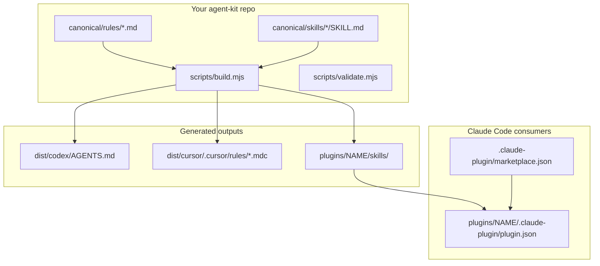

# Agent-kit repos

Guide to **agent-kit distribution repos** — one canonical source of rules and skills, multiple generated adapters for Claude Code, Cursor, and Codex.

Use this when you want a **team-wide policy + skills package**, not a single app or a flat Claude plugin like `tamirs-superpowers`.

---

## Three repo shapes

| Shape | Example | Skills live in | Standards profile |
|-------|---------|----------------|-------------------|
| **App / library** | Node API, Python service | `.agents/skills/` or `.claude/skills/` | `app-gold` |
| **Flat Claude plugin** | `tamirs-superpowers` | `skills/<domain>/<name>/` at repo root | `app-gold` |
| **Agent-kit distribution** | Team engineering kit | `canonical/skills/` → generated copies | `plugin-gold` |

**Key idea:** Claude Code plugins are Claude-specific. The portable layer is **tool-neutral canonical files** + **generated adapters** — not a single plugin-only layout.

---

## Architecture



**Contributor rule:** edit `canonical/` only. Run `npm run build`. Never hand-edit `dist/` or generated plugin skill copies.

---
## Platform capability parity

Agent-kit repos target **capability parity** across Claude Code, Cursor, and Codex — not identical files on every platform.

| Concern | Source | Generated / per-platform |
|---------|--------|---------------------------|
| Policy | `canonical/rules/` | `dist/codex/AGENTS.md`, `dist/cursor/.cursor/rules/` |
| Skills | `canonical/skills/` | `plugins/<name>/skills/` |
| Platform versions | `docs/engineering/build-and-release/platform-targets.json` | README Row 3 badges |

After changing canonical content or repo skills:

1. `npm run build && npm run validate`
2. `make agent:check`
3. `make platform-targets-sync (agent)` and update `validated_against` when adopting new platform APIs

See [`platform-equivalence.md`](../agent-guidelines/platform-equivalence.md) for intentional asymmetry (hooks, Claude-only features).


## Directory layout (after scaffold)

```
my-agent-kit/
├── agent-kit.config.json          # paths + plugin name
├── canonical/
│   ├── rules/                     # tool-neutral policy (source of truth)
│   │   ├── core.md
│   │   ├── testing.md
│   │   ├── security.md
│   │   ├── frontend.md
│   │   └── backend.md
│   ├── skills/<name>/SKILL.md     # portable skills (source)
│   └── templates/*.hbs            # future Handlebars pipeline
├── scripts/
│   ├── build.mjs                  # generates dist/ + plugin skills
│   └── validate.mjs               # layout + GENERATED marker checks
├── dist/                          # GENERATED — do not edit
│   ├── codex/AGENTS.md
│   └── cursor/.cursor/rules/000-core.mdc
├── plugins/<name>/
│   ├── .claude-plugin/plugin.json
│   ├── skills/                    # GENERATED copy from canonical/skills
│   ├── commands/
│   ├── agents/
│   └── hooks/hooks.json
├── .claude-plugin/
│   └── marketplace.json           # catalog → ./plugins/<name>
├── AGENTS.md                      # contributor rules for THIS repo
├── CLAUDE.md                      # @AGENTS.md + Claude addenda
├── package.json                   # build, validate, agent:check
└── docs/engineering/agent-kit-architecture.md
```

---

## Create a new agent-kit repo

### Prerequisites

- Claude Code with `tamirs-superpowers` installed
- `gh` CLI authenticated (`gh auth login`)
- Node.js 22+ (plugin scaffold forces `node` stack)

### Command

```text
/tamirs-superpowers:repo-scaffold my-agent-kit -- "Shared engineering rules and skills for the team" --type plugin
```

**Flags:**

| Flag | Default | Meaning |
|------|---------|---------|
| `--type plugin` | `app` | Agent-kit layout + `plugin-gold` contract |
| `--tech node` | auto (forced to `node` for plugin) | Toolchain for build scripts |

### What scaffold produces

1. Private GitHub repo under `TamirCohen28/<name>`
2. Full `app-gold` baseline (README, docs tree, CI, AGENTS.md, branch protection)
3. Agent-kit tree (`canonical/`, `dist/`, `plugins/<name>/`, marketplace manifest)
4. Stub `build.mjs` that copies rules → `dist/codex/AGENTS.md`, core rule → Cursor `.mdc`, skills → plugin wrapper
5. CI jobs: `CI`, `validate`, `secret-scan`
6. Contract gate: `assert-contract.sh plugin-gold` before push

### After scaffold

```bash
gh repo clone TamirCohen28/my-agent-kit
cd my-agent-kit
npm ci
npm run build      # regenerate dist/ + plugin skills
npm run validate   # must pass before PRs
```

---

## Daily contributor workflow

1. **Edit canonical only** — `canonical/rules/*.md` and `canonical/skills/*/SKILL.md`
2. **Keep rules tool-neutral** — no `$CLAUDE_*`, no `!` blocks, no YAML frontmatter in rules
3. **Build adapters:**

   ```bash
   npm run build
   npm run validate
   ```

4. **Open PR** — CI `validate` job runs the same checks
5. **Never edit** `dist/` or `plugins/<name>/skills/` by hand (they are regenerated)

### Root `AGENTS.md` vs consumer `dist/codex/AGENTS.md`

| File | Audience |
|------|----------|
| `AGENTS.md` (repo root) | Contributors to the agent-kit repo |
| `dist/codex/AGENTS.md` | Generated policy for target app repos / Codex |
| `dist/cursor/.cursor/rules/*.mdc` | Generated rules for Cursor consumers |

---

## Install as a Claude Code plugin

From a Claude Code session (after the repo is on GitHub):

```text
/plugin marketplace add TamirCohen28/my-agent-kit
/plugin install my-agent-kit@<marketplace-name-from-marketplace.json>
```

The marketplace name is in `.claude-plugin/marketplace.json` (e.g. `my-agent-tools`).

---

## Install into a target app repo (future)

v1 scaffolds a stub `agent:update` script. Full `sync-to-repo.mjs` / `npx @org/agent-kit install --target .` is **not implemented yet**.

**Intended target layout** (after install ships):

```
target-app/
├── AGENTS.md              # from dist/codex/
├── CLAUDE.md              # thin wrapper
├── .cursor/rules/*.mdc    # from dist/cursor/
└── .agents/skills/        # from canonical/skills/
```

Until then, copy or symlink generated files manually from `dist/` after `npm run build`.

---

## Audit and polish with repo-standards

`repo-standards` **auto-detects** the contract profile:

| Detection | Profile |
|-----------|---------|
| `canonical/rules/` exists | `plugin-gold` |
| Otherwise | `app-gold` |

```text
/tamirs-superpowers:repo-standards review
/tamirs-superpowers:repo-standards plan
/tamirs-superpowers:repo-standards polish
```

**Plugin-gold extras:**

- PK* gap checks (marketplace manifest, canonical layout, GENERATED markers, validate CI job, CODEOWNERS paths)
- Manual review axes in skill `references/plugin-review.md` (tool-neutral rules, supply-chain, version strategy)
- Polish always runs `changelog-review` on plugin/agent-kit repos

---

## Contract validation (local)

From any clone of an agent-kit repo:

```bash
npm run build
npm run validate
```

From `tamirs-superpowers` (offline, no branch-protection checks):

```bash
CONTRACT_OFFLINE=1 bash skills/repo/_contract/scripts/assert-contract.sh \
  /path/to/my-agent-kit plugin-gold
```

---

## Security model

Treat agent-kit repos as **supply chain**, not harmless markdown:

- **CODEOWNERS** on `canonical/`, `plugins/`, `scripts/`, `hooks/`
- No hidden `postinstall` or network fetch in install scripts (v1)
- **changelog-review** on polish for Claude Code plugin misuse
- Separate “instructions-only” (`canonical/`) from executable surfaces (`hooks/`, scripts) when scaling to teams

---

## What's implemented vs stub (v1)

| Feature | Status |
|---------|--------|
| Scaffold `--type plugin` | Implemented |
| `plugin-gold` contract + CI fixture | Implemented |
| `build.mjs` stub (core rule → dist + skill copy) | Implemented |
| `validate.mjs` layout checks | Implemented |
| Full Handlebars pipeline (all rules → all adapters) | Follow-up |
| `npx @org/agent-kit install --target .` | Follow-up |
| Migrating flat plugins (e.g. tamirs-superpowers) to agent-kit | Optional follow-up |

---

## Related docs

| Doc | Content |
|-----|---------|
| [Skills — repo domain](skills.md#repo) | What each repo skill does |
| [Contract package](../../skills/repo/_contract/README.md) | `app-gold` vs `plugin-gold`: templates, scoring scripts, gold fixtures |
| [Engineering architecture](../engineering/architecture/overview.md) | Contract package in this plugin |
| Contract templates | `skills/repo/_contract/templates/plugin/` |
