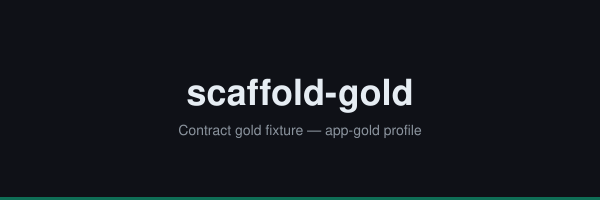

<p align="center">
  
</p>

<p align="center">
  <a href="https://github.com/Tamircohen28">
    
  </a>
  <a href="https://github.com/TamirCohen28/scaffold-gold/actions/workflows/ci.yml">
    
  </a>
  <a href="LICENSE">
    
  </a>
  <a href="package.json">
    
  </a>
</p>

<p align="center">
  
</p>

<p align="center">
  <a href="docs/engineering/build-and-release/platform-targets.json">
    
  </a>
  <a href="docs/engineering/build-and-release/platform-targets.json">
    
  </a>
  <a href="docs/engineering/build-and-release/platform-targets.json">
    
  </a>
</p>

# scaffold-gold

Contract gold fixture — minimal Node app matching app-gold profile.

## Prerequisites

- Node.js 22 (see `.nvmrc`)
- npm 10+

## Quick Start

```bash
make install
make test
```

### Claude Code

Open in Claude Code — `CLAUDE.md` imports `AGENTS.md`.

### Cursor

Rules live in `.cursor/rules/000-project.mdc` (points to `AGENTS.md`).

### Codex

Codex reads root `AGENTS.md` for repo policy.

## Documentation

See [docs/README.md](docs/README.md).

## Contributing

See [docs/CONTRIBUTING.md](docs/CONTRIBUTING.md).

## License

MIT — see [LICENSE](LICENSE).
