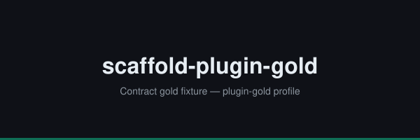

<p align="center">
  
</p>

<p align="center">
  <a href="https://github.com/Tamircohen28">
    
  </a>
  <a href="https://github.com/TamirCohen28/scaffold-plugin-gold/actions/workflows/ci.yml">
    
  </a>
  <a href="LICENSE">
    
  </a>
  <a href="package.json">
    
  </a>
</p>

<p align="center">
  
  
</p>

<p align="center">
  
  
  
</p>

# scaffold-plugin-gold

Contract gold fixture — agent-kit plugin repo matching plugin-gold profile.

## Prerequisites

- Node.js 22 (see `.nvmrc`)
- npm 10+

## Quick Start

```bash
make install
make validate
```

### Claude Code

```
/plugin marketplace add TamirCohen28/scaffold-plugin-gold
/plugin install scaffold-plugin-gold@scaffold-plugin-tools
```

### Cursor / Codex

After `make install`, adapters are under `dist/cursor/` and `dist/codex/`.

## Documentation

See [docs/README.md](docs/README.md).

## Contributing

See [docs/CONTRIBUTING.md](docs/CONTRIBUTING.md).

## License

MIT — see [LICENSE](LICENSE).
